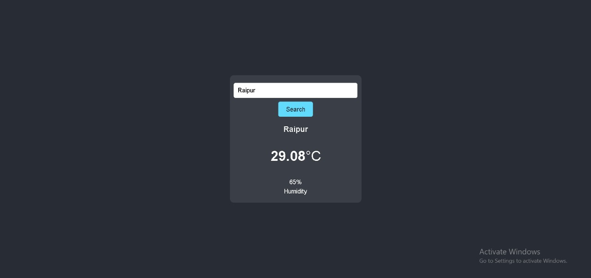

### Weather Dashboard
Weather Dashboard is a simple and intuitive weather application built using React. It allows users to search for the current weather and view humidity levels for any city. The application fetches weather data from the OpenWeatherMap API and displays it in a user-friendly interface.

### Features
- **City Search:** Enter the name of a city to get the current weather details.
- **Current Weather Display:** Shows the temperature and humidity for the selected city.
- **Responsive Design:** The app is responsive and works on all screen sizes.
- **API Integration:** Fetches real-time data from the OpenWeatherMap API.

### Installation
**Clone the repository:**
- git clone https://github.com/shreya-kushwaha40/Weather.git
- cd weather-dashboard

**Install dependencies:**
- npm install

**Run the application:**
- npm run dev

### Usage
- Search for a city: Enter the name of the city you want to check the weather for in the search bar at the top of the page.
- View weather details: The current temperature and humidity for the city will be displayed below the search bar.

### Project Structure

weather-app/
├── public/
│   └── index.html
├── src/
│   ├── App.jsx
│   ├── App.css
│   ├── index.js
│   └── ...
└── package.json

### Weather Dashboard

### Future Improvements
- 5-day Forecast: Extend the application to display a 5-day weather forecast.
- Favorite Cities: Implement functionality to save and quickly access favorite cities.
- Weather Icons: Display icons representing different weather conditions (e.g., sunny, cloudy, rainy).

### Acknowledgments
- OpenWeatherMap for the weather API.
