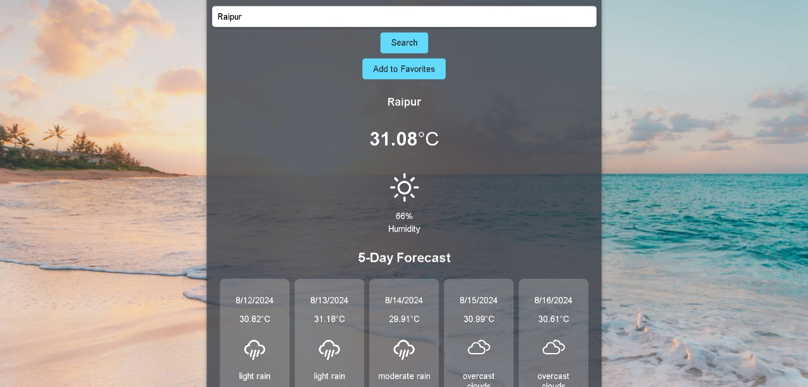

### Weather Application
The Weather Application is a sleek and user-friendly React-based application that allows users to search for and view the current weather, including humidity levels, for any city. The app fetches weather data in real-time from the OpenWeatherMap API and presents it in a clean and accessible interface.

### Features
- **City Search:** Quickly find and display weather details by entering a city name.
- **Weather Information:** Displays the current temperature and humidity for the chosen city.
- **Real-Time Data:** Utilizes the OpenWeatherMap API to fetch up-to-date weather information.

### Installation
**Clone the repository:**
- git clone https://github.com/Rickykumar010/application_weather.git
- cd weather-dashboard

**Install dependencies:**
- npm install

**Run the application:**
- npm run dev

### How to Use
- Search for a city: Enter the name of the city you want to check the weather for in the search bar at the top of the page.
- View weather details: The current temperature and humidity for the city will be displayed below the search bar.

### Project Structure

weather-app/
├── public/
│   └── index.html
├── src/
│   ├── App.jsx
│   ├── App.css
│   ├── index.js
│   └── Weather.jsx
└── package.json

### Weather Application Screenshot

### Planned Enhancements
- **Extended Forecast:** Add functionality to display a 5-day weather forecast for the searched city.
- **Favorite Cities:** Allow users to save favorite cities for quick access.
- **Dynamic Weather Icons:** Display icons corresponding to different weather conditions (e.g., sunny, cloudy, rainy).

### Acknowledgments
- OpenWeatherMap for the weather API.
